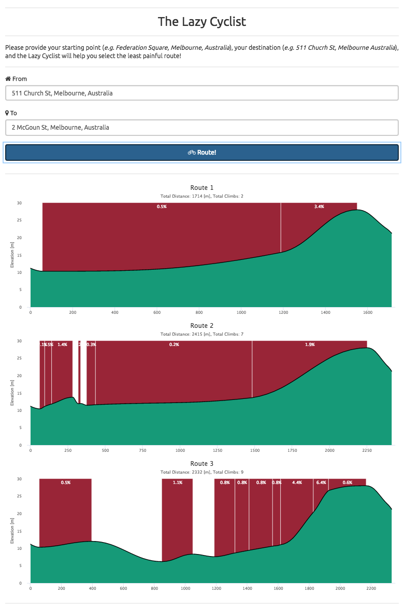

# Lazy Cyclist
This project show the elevation profiles of different bicycle routes to help
the lazy cyclist pick the easiest one. A **live demo** is available at [http://kalimaha.github.io/lazy-cyclist/](http://kalimaha.github.io/lazy-cyclist/).

# Architecture

A two-layers architecture with the front-end developed in Elm and the back-end
with Java (_REST services_) and Scala (_core business logic_). There is no real
need for such organization, but I wanted to learn both Scala and Elm, so...
